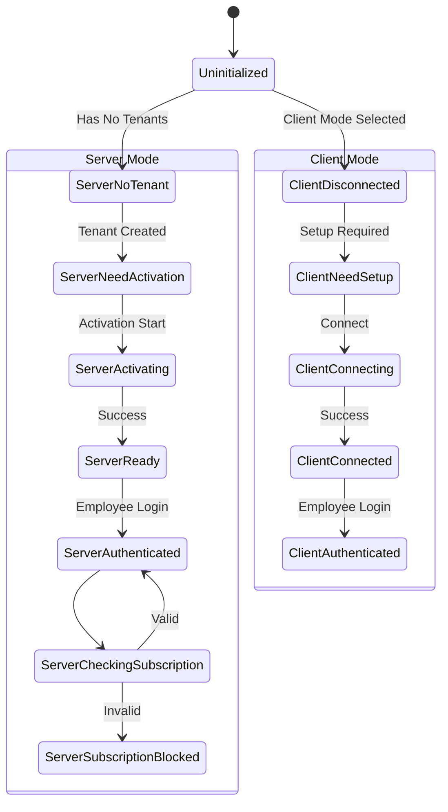
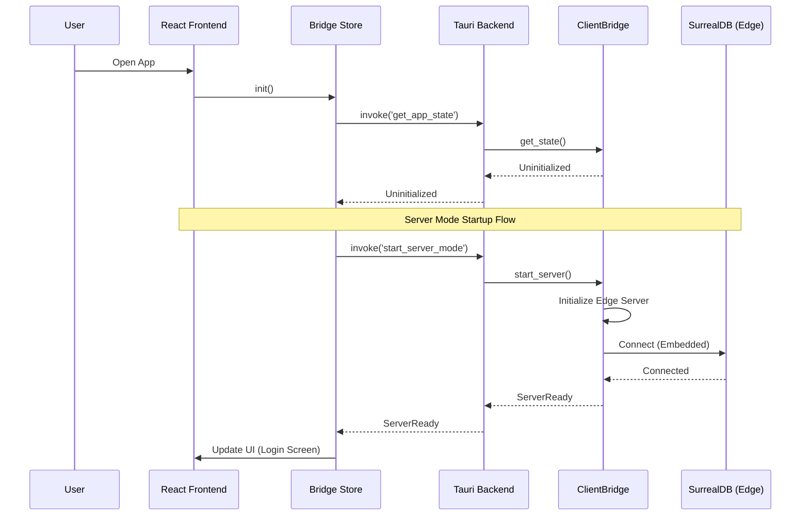

# RedCoral POS Architecture

## System Architecture

```mermaid
graph TD
    subgraph "Frontend (React + TypeScript)"
        UI[UI Components]
        Stores[Zustand Stores]
        Services[Domain Services]
        
        UI --> Stores
        UI --> Services
        Stores --> Services
    end

    subgraph "Tauri Interface"
        Commands[Tauri Commands]
        Events[Tauri Events]
    end

    subgraph "Rust Backend (src-tauri)"
        Bridge[ClientBridge]
        TenantMgr[TenantManager]
        Printer[Printer Service]
        
        Commands --> Bridge
        Commands --> TenantMgr
        Commands --> Printer
        Bridge --> Events
    end

    subgraph "Data Access Layer (Shared)"
        CrabClient[Crab Client Trait]
    end

    subgraph "Modes"
        LocalClient[Local Client (In-Process)]
        RemoteClient[Remote Client (mTLS)]
    end

    subgraph "Infrastructure"
        EdgeServer[Edge Server (SurrealDB)]
        RemoteServer[Remote Edge Server]
    end

    Services -->|"invoke()"| Commands
    Events -->|"listen()"| Services

    Bridge --> TenantMgr
    Bridge --> CrabClient
    
    CrabClient -.->|"Server Mode"| LocalClient
    CrabClient -.->|"Client Mode"| RemoteClient
    
    LocalClient -->|"Direct Call"| EdgeServer
    RemoteClient -->|"gRPC/mTLS"| RemoteServer
```

## State Machine (ClientBridge)



## Component Interaction Flow


